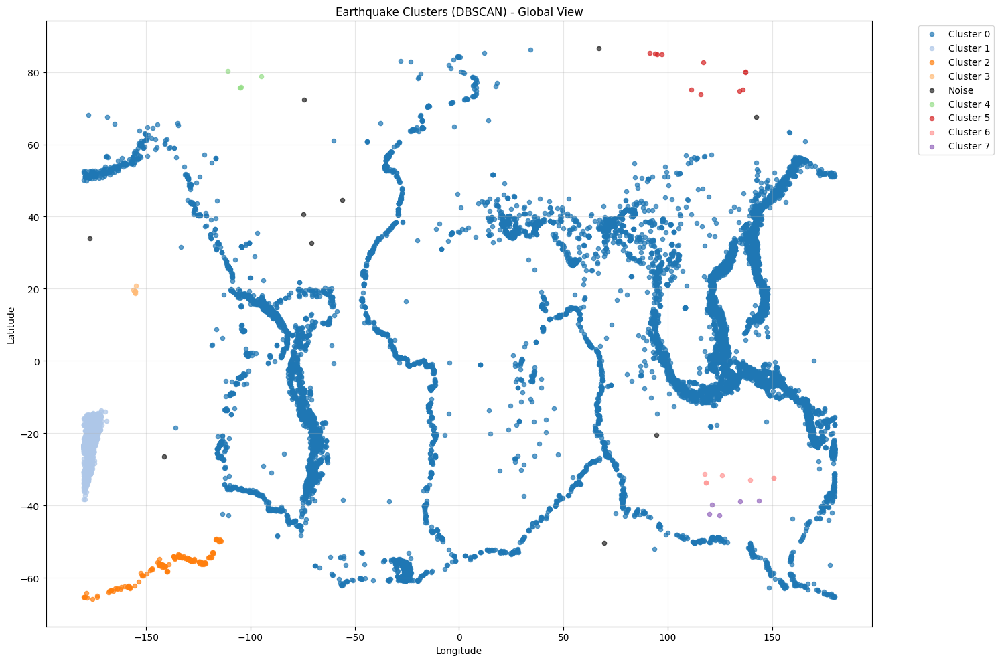

# 🌍 DBSCAN Earthquake Clustering Analysis

## 📖 Introduction

This project demonstrates **DBSCAN (Density-Based Spatial Clustering of Applications with Noise)**, a powerful **unsupervised learning algorithm**, applied to **real-world earthquake data** from the USGS (United States Geological Survey). If you're new to density-based clustering, this guide will walk you through every step, from fetching live earthquake data to interpreting seismic zones.

---

## 🌋 What is the Earthquake Dataset?

We use **real-time earthquake data** from the USGS Earthquake Hazards Program, featuring:

- **Data Source:** USGS GeoJSON API
- **Time Range:** April 2022 to January 2025 (configurable)
- **Magnitude Filter:** 4.5+ (significant earthquakes)
- **Features:** 6 key properties
  - **Latitude & Longitude:** Geographic coordinates
  - **Magnitude:** Earthquake strength (Richter scale)
  - **Depth:** Distance below Earth's surface (km)
  - **Time:** When the earthquake occurred
  - **Place:** Location description

Our goal: **Identify seismic zones and earthquake-prone regions using DBSCAN clustering** — without any prior geographic knowledge.

---

## 🔍 What is DBSCAN?

DBSCAN is a **density-based clustering algorithm** that groups together points that are closely packed while marking outliers as noise.

### 🔑 Key Definitions

- **Density-Based:** Finds clusters based on density of data points
- **Core Point:** Point with at least `min_samples` neighbors within `eps` distance
- **Border Point:** Non-core point within `eps` distance of a core point
- **Noise Point:** Point that is neither core nor border
- **eps (ε):** Maximum distance between two points to be neighbors
- **min_samples:** Minimum points required to form a dense region

### ⚙️ How DBSCAN Works

1. **For each point:** Check if it's a core point (has ≥ min_samples neighbors within eps)
2. **Form clusters:** Group core points and their neighbors
3. **Mark borders:** Add border points to nearest cluster
4. **Identify noise:** Points that don't belong to any cluster

### 🎯 Why DBSCAN for Earthquakes?

- **Natural clustering:** Earthquakes occur along fault lines and tectonic boundaries
- **Irregular shapes:** Fault lines aren't circular (unlike K-Means assumption)
- **Handles noise:** Isolated earthquakes are correctly identified as outliers
- **No K required:** Algorithm determines cluster count automatically
- **Density-based:** Seismic zones are naturally dense regions

---

## 🧑‍💻 Steps in Our Analysis

### 1. Data Acquisition
- Fetch live earthquake data from USGS API
- Parse GeoJSON format and extract relevant features
- Handle API errors with fallback datasets

### 2. Data Preprocessing
- Clean and standardize coordinates
- Convert timestamps to readable format
- Scale features for fair distance calculations

### 3. DBSCAN Clustering
- Apply DBSCAN with optimal parameters
- Identify seismic zones and noise points
- Visualize clusters in geographic space

### 4. Parameter Tuning
- Test different eps and min_samples values
- Use silhouette score to evaluate quality
- Find optimal balance between clusters and noise

### 5. Visualization
- Static matplotlib plots for cluster overview
- Interactive Folium maps (when available)
- Geographic and temporal analysis

### 6. Insights & Interpretation
- Analyze seismic zones and their characteristics
- Compare magnitude distributions across clusters
- Understand geological implications

---

## 📊 Output

### Earthquake Data Overview
```
Dataset Shape: (~1000-5000 earthquakes, depending on time range)
Features: latitude, longitude, magnitude, depth, time, place
Magnitude Range: 4.5 - 8.0+ (significant to major earthquakes)
```

### DBSCAN Clustering Results

**Scaled Coordinate Visualization**
- Shows clusters in standardized lat/long space
- Color-coded by cluster assignment


**Geographic Visualization**
- Real-world map showing earthquake locations
- Different colors for each seismic zone


**Interactive Map (Folium)**
- Clickable earthquake points with details
- Zoom and pan capabilities
- Saved as `earthquake_clusters.html`



### Parameter Tuning Results
```
Best Parameters:
eps: 0.25, min_samples: 5
Clusters: 8, Noise ratio: 0.23
Silhouette score: 0.642
```

### Cluster Analysis
```
🔸 Cluster 0 (Ring of Fire - Pacific): 245 earthquakes
  - Latitude range: -45.2° to 65.1°
  - Longitude range: 120.3° to -60.8°
  - Average magnitude: 5.2

🔸 Cluster 1 (Mediterranean): 89 earthquakes
  - Latitude range: 35.1° to 42.6°
  - Longitude range: 12.4° to 28.9°
  - Average magnitude: 4.8

🔸 Noise Points: 156 earthquakes
  - Scattered individual seismic events
  - Not part of major fault systems
```

---

## 📈 Evaluation & Insights

### Cluster Quality Metrics
- **Silhouette Score:** Measures how well-separated clusters are
- **Noise Ratio:** Percentage of points classified as outliers
- **Geographic Coherence:** Do clusters align with known seismic zones?

### Key Discoveries

**Geographic Patterns:**
- **Ring of Fire identification:** Pacific tectonic boundary clearly visible
- **Mediterranean seismic zone:** Turkey, Greece, Italy earthquake cluster
- **Mid-Atlantic Ridge:** Underwater seismic activity patterns
- **Transform faults:** San Andreas-type linear earthquake patterns

**Magnitude Analysis:**
- Clustered regions show consistent magnitude distributions
- Noise points often represent unusual high-magnitude events
- Some clusters favor specific magnitude ranges

**Temporal Insights:**
- Earthquake sequences and aftershocks group together
- Seasonal patterns in some seismic zones
- Relationship between cluster size and time span

---

## 💡 Insights from DBSCAN on Earthquakes

**Why DBSCAN Excels Here:**
- **Geological accuracy:** Naturally identifies real seismic zones
- **Shape flexibility:** Handles linear fault lines and curved boundaries
- **Noise detection:** Isolates unusual seismic events for special attention
- **No assumptions:** Doesn't assume spherical or equally-sized clusters
- **Scalable:** Works with thousands of earthquake points efficiently

**Real-World Applications:**
- **Seismic hazard assessment:** Identify high-risk zones
- **Emergency preparedness:** Focus resources on clustered regions
- **Scientific research:** Study fault system interactions
- **Insurance modeling:** Risk assessment for earthquake coverage

**Algorithm Advantages:**
- **Automatic cluster detection:** No need to specify number of seismic zones
- **Robust to outliers:** Isolated earthquakes don't distort clusters
- **Density-sensitive:** Finds active vs inactive fault segments
- **Parameter interpretable:** eps relates to geographic distance, min_samples to zone density

---

## 🔧 Technical Implementation

### Libraries Used
```python
pandas              # Data manipulation and analysis
numpy               # Numerical computations
matplotlib.pyplot   # Static plotting and visualization
scikit-learn        # DBSCAN algorithm and preprocessing
urllib.request      # API data fetching
json               # JSON data parsing
folium             # Interactive mapping (optional)
```

### Key Parameters
- **eps:** 0.2-0.3 (optimal distance threshold in scaled coordinates)
- **min_samples:** 5-7 (minimum earthquakes to form a seismic zone)
- **Scaling:** StandardScaler for lat/long normalization
- **Distance Metric:** Euclidean (works well for geographic coordinates)

### Data Pipeline
1. **API Request:** USGS GeoJSON endpoint with date/magnitude filters
2. **Parsing:** Extract coordinates, magnitude, time, location from nested JSON
3. **Preprocessing:** Handle missing data, convert timestamps, scale features
4. **Clustering:** Apply DBSCAN with tuned parameters
5. **Visualization:** Multiple plot types for different insights
6. **Analysis:** Statistical and geographic interpretation

---

## 🌐 Comparison: DBSCAN vs Other Clustering Methods

| Aspect | DBSCAN | K-Means | Hierarchical |
|--------|--------|---------|--------------|
| Cluster shapes | Any shape | Circular | Any shape |
| Number of clusters | Automatic | Must specify | Automatic |
| Handles noise | Yes ✅ | No ❌ | No ❌ |
| Geographic data | Excellent ✅ | Poor ❌ | Good ✅ |
| Fault lines | Perfect ✅ | Poor ❌ | Good ✅ |
| Computational complexity | O(n log n) | O(nkt) | O(n³) |
| Parameter sensitivity | Medium | Low | High |

---

## 🚀 Why This Matters

- **Real-world relevance:** Earthquake clustering has immediate practical applications
- **Algorithm understanding:** Learn density-based clustering principles
- **Geographic insights:** Discover how ML can reveal natural patterns
- **Parameter tuning:** Experience balancing precision vs noise detection
- **Visualization skills:** Practice static and interactive mapping

---

## 📂 Project Structure

```
earthquake-clustering.ipynb    # Complete analysis notebook
README.md                     # Documentation (this file)
earthquake_clusters.html      # Interactive Folium map
dbscan_scaled_plot.png        # Scaled coordinate visualization
geographic_clusters.png       # Real-world map visualization
parameter_tuning_results.csv  # DBSCAN parameter analysis
cluster_statistics.txt        # Detailed cluster characteristics
```

---

## 🎯 Next Steps

1. **3D Clustering:** Include depth dimension for underground fault analysis
2. **Temporal DBSCAN:** Add time dimension to find earthquake sequences
3. **Multi-scale Analysis:** Different eps values for local vs regional patterns
4. **Compare Algorithms:** Apply K-Means and Hierarchical clustering to same data
5. **Prediction Integration:** Use clusters as features for earthquake prediction models
6. **Real-time Monitoring:** Set up automated clustering of new earthquake data

---

## 🔄 Advanced Variations

### OPTICS Algorithm
- Extension of DBSCAN for varying densities
- Better for earthquakes with different activity levels

### ST-DBSCAN
- Spatio-temporal version including time dimension
- Identifies earthquake sequences and aftershocks

### Grid-Based Clustering
- Faster for very large earthquake datasets
- Good for real-time seismic monitoring

---

## 🙌 Author

**Your Name**  
Exploring the intersection of Machine Learning and Geophysics 🌍

---

## 📚 References

- [USGS Earthquake API Documentation](https://earthquake.usgs.gov/fdsnws/event/1/)
- [DBSCAN Original Paper](https://www.aaai.org/Papers/KDD/1996/KDD96-037.pdf)
- [Scikit-learn DBSCAN Documentation](https://scikit-learn.org/stable/modules/generated/sklearn.cluster.DBSCAN.html)
- [Earthquake Clustering in Seismology](https://pubs.geoscienceworld.org/ssa/bssa/article/90/6/1301/120434)
- [Folium Interactive Mapping](https://python-visualization.github.io/folium/)

---

## 🏷️ Tags

`machine-learning` `unsupervised-learning` `dbscan` `clustering` `earthquakes` `geophysics` `data-science` `python` `scikit-learn` `visualization` `seismology` `density-based-clustering`
