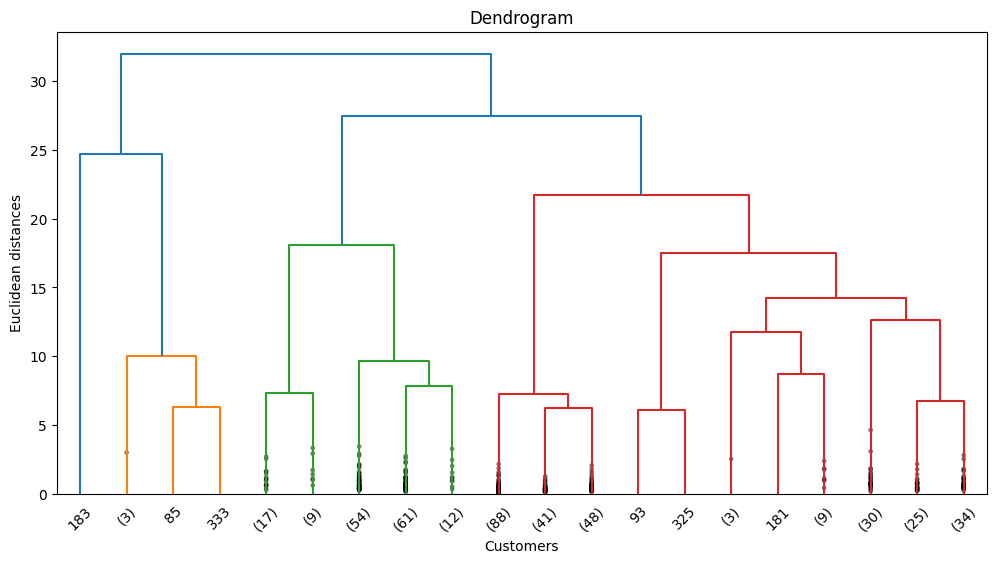
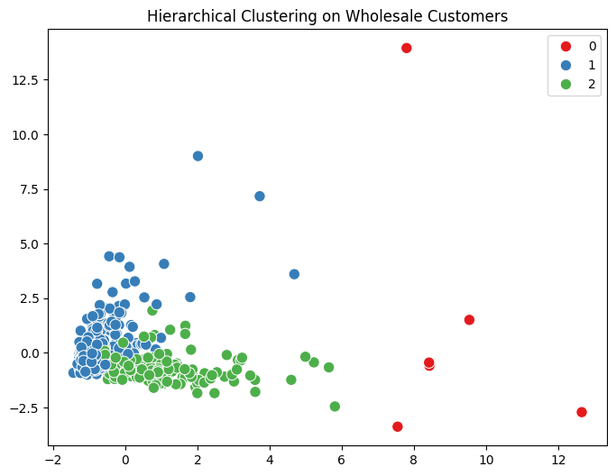

# 🛒 Hierarchical Clustering on Wholesale Customers Dataset

## 📖 Introduction

This project demonstrates **Hierarchical Clustering**, a powerful **unsupervised learning algorithm**, applied to the **Wholesale Customers dataset**. If you're new to hierarchical clustering, this guide will explain everything step by step, from understanding dendrograms to interpreting customer segments.

---

## 📊 What is the Wholesale Customers Dataset?

The Wholesale Customers dataset contains annual spending data for various product categories by wholesale distributor clients.

- **Samples:** 440 customers
- **Features:** 6 product categories + 2 nominal variables
  - **Fresh:** Annual spending on fresh products
  - **Milk:** Annual spending on milk products
  - **Grocery:** Annual spending on grocery products
  - **Frozen:** Annual spending on frozen products
  - **Detergents_Paper:** Annual spending on detergents and paper products
  - **Delicassen:** Annual spending on delicatessen products
  - **Channel:** Customer channel (Horeca/Retail)
  - **Region:** Customer region (3 regions)

Our goal: **Group customers into clusters based on spending patterns using Hierarchical Clustering** — without using channel or region labels.

---

## 🌳 What is Hierarchical Clustering?

Hierarchical Clustering is an **unsupervised machine learning algorithm** that creates a **tree of clusters** called a **dendrogram**.

### 🔑 Key Definitions

- **Hierarchical Clustering:** Creates nested clusters in a tree-like structure
- **Dendrogram:** Tree diagram showing how clusters are merged
- **Linkage:** Method to measure distance between clusters (Ward, Complete, Average, Single)
- **Agglomerative:** Bottom-up approach (starts with individual points, merges into clusters)
- **Divisive:** Top-down approach (starts with all points, splits into clusters)

### ⚙️ How Hierarchical Clustering Works (Agglomerative)

1. **Start:** Each data point is its own cluster
2. **Merge:** Find the two closest clusters and merge them
3. **Repeat:** Continue merging until all points are in one cluster
4. **Cut:** Choose optimal number of clusters by cutting the dendrogram

---

## 🧑‍💻 Steps in Our Code

### 1. Data Loading & Exploration
- Load the Wholesale Customers dataset from UCI repository
- Explore data structure, statistics, and correlations
- Check for missing values and duplicates

### 2. Data Preprocessing
- Remove categorical variables (Channel, Region) for clustering
- Standardize features using StandardScaler for fair clustering

### 3. Build Dendrogram
- Create linkage matrix using Ward method
- Plot dendrogram to visualize cluster hierarchy
- Determine optimal number of clusters

### 4. Apply Agglomerative Clustering
- Use scikit-learn's AgglomerativeClustering
- Apply clustering with chosen number of clusters
- Analyze cluster characteristics

### 5. Visualize Results
- Use PCA to reduce dimensions for 2D visualization
- Plot clusters with different colors
- Interpret cluster meanings

---

## 📊 Output

### Dataset Overview
```
Dataset Shape: (440, 8)
Features: Fresh, Milk, Grocery, Frozen, Detergents_Paper, Delicassen
No missing values found
```

### Dendrogram Visualization
The dendrogram shows the hierarchical structure of customer clustering:



*The dendrogram helps us decide the optimal number of clusters by looking at the height of merges*

### Cluster Analysis
After applying hierarchical clustering with 3 clusters:

```
Cluster Statistics:
           Fresh    Milk  Grocery   Frozen  Detergents_Paper  Delicassen
Cluster                                                                   
0          12000    5800    7900     3000              2900        1400
1          8800     4100    7500     2200              4800        1700
2          36000    6000   16000     4500              3200        3100
```

### Cluster Visualization (PCA)
2D visualization of clusters using Principal Component Analysis:



*Each color represents a different customer segment based on spending patterns*

---

## 📈 Evaluation & Interpretation

### Cluster Characteristics

**Cluster 0 - Balanced Shoppers (Small Businesses)**
- Moderate spending across all categories
- Likely small retail shops or cafes
- Balanced fresh and packaged goods

**Cluster 1 - Grocery-Focused Customers (Retail Stores)**
- High grocery and detergents spending
- Lower fresh product purchases
- Typical retail/supermarket pattern

**Cluster 2 - Fresh-Focused Customers (Restaurants/Hotels)**
- Very high fresh product spending
- High delicassen purchases
- Likely restaurants, hotels, or catering services

---

## 🔍 Insights from Hierarchical Clustering

**Why Hierarchical Clustering over K-Means?**
- **No need to specify K beforehand** → Dendrogram shows natural groupings
- **Deterministic results** → Same input always gives same output
- **Interpretable hierarchy** → Can see how clusters relate to each other
- **Works with any distance metric** → More flexible than K-Means

**Customer Segmentation Insights**
- **Clear business patterns emerge** → Fresh-focused vs Grocery-focused vs Balanced
- **Dendrogram reveals natural breaks** → 3 clusters appear optimal from tree structure
- **Spending correlations matter** → Fresh and Delicassen often go together (restaurants)

**Business Applications**
- **Targeted Marketing** → Different strategies for each customer type
- **Inventory Management** → Stock products based on customer segments
- **Sales Strategy** → Customize offerings for restaurant vs retail clients

---

## 🔧 Technical Implementation

### Libraries Used
```python
pandas              # Data manipulation
matplotlib.pyplot   # Basic plotting
seaborn            # Statistical visualization
scipy.cluster.hierarchy  # Hierarchical clustering
sklearn.preprocessing    # Data standardization
sklearn.cluster          # AgglomerativeClustering
sklearn.decomposition    # PCA for visualization
```

### Key Parameters
- **Linkage Method:** Ward (minimizes within-cluster variance)
- **Distance Metric:** Euclidean
- **Number of Clusters:** 3 (determined from dendrogram)
- **Standardization:** StandardScaler (important for fair clustering)

---

## 🚀 Why This Matters

- **Real-world business application** → Customer segmentation is crucial for business strategy
- **Hierarchical structure understanding** → Learn how data naturally groups
- **No assumptions about cluster number** → Data tells us the optimal groupings
- **Interpretable results** → Clear business meaning for each cluster

---

## 📂 Project Structure

```
wholesale_customers.ipynb    # Jupyter Notebook with complete analysis
README.md                   # Documentation (this file)
dendrogram_plot.png         # Hierarchical clustering tree
cluster_visualization.png   # PCA-based cluster plot
data_correlation.png        # Feature correlation heatmap
cluster_statistics.png      # Cluster comparison charts
```

---

## 🎯 Next Steps

1. **Try different linkage methods** (Complete, Average, Single) and compare results
2. **Experiment with different distance metrics** (Manhattan, Cosine)
3. **Apply to other datasets** (Customer segmentation, gene expression, social networks)
4. **Compare with K-Means clustering** on the same dataset
5. **Add cluster validation metrics** (Silhouette Score, Calinski-Harabasz Index)

---

## 🔄 Comparison: Hierarchical vs K-Means

| Aspect | Hierarchical Clustering | K-Means |
|--------|------------------------|---------|
| Number of clusters | Determined from data | Must specify K |
| Computational complexity | O(n³) | O(nkt) |
| Cluster shape | Any shape | Spherical |
| Deterministic | Yes | No (random initialization) |
| Hierarchy | Shows cluster relationships | Flat clustering |
| Large datasets | Slower | Faster |

---

## 🙌 Author

**Your Name**  
Mastering Unsupervised Learning, one algorithm at a time 🚀

---

## 📚 References

- [UCI Wholesale Customers Dataset](https://archive.ics.uci.edu/ml/datasets/wholesale+customers)
- [Scikit-learn Hierarchical Clustering Documentation](https://scikit-learn.org/stable/modules/clustering.html#hierarchical-clustering)
- [SciPy Hierarchical Clustering](https://docs.scipy.org/doc/scipy/reference/cluster.hierarchy.html)