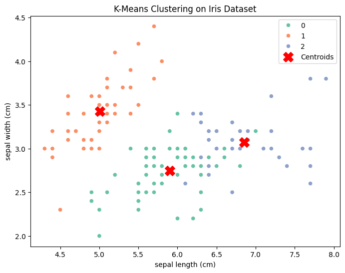
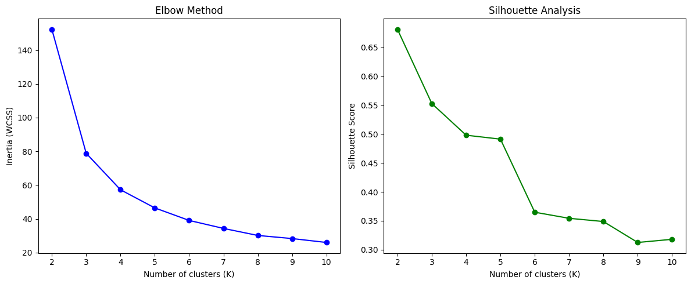

# K-Means Clustering on Iris Dataset

## 📖 Introduction

This project demonstrates **K-Means clustering**, an **unsupervised learning algorithm**, applied on the famous **Iris dataset**.  
If you're a beginner, don’t worry! This README will explain **everything step by step** so that by the end, you’ll **master K-Means** and understand how clustering works.

---

## 🌸 What is the Iris Dataset?

The Iris dataset is a famous dataset in machine learning, introduced by the statistician **Ronald Fisher** in 1936.  
It contains measurements of **150 iris flowers** belonging to **3 species**:

- **Setosa**
- **Versicolor**
- **Virginica**

Each flower has **4 features**:

1. Sepal length (cm)  
2. Sepal width (cm)  
3. Petal length (cm)  
4. Petal width (cm)

Our goal: **Group these flowers into clusters using K-Means** — without looking at the species labels.

---

## 🤔 What is K-Means Clustering?

K-Means is an **unsupervised machine learning algorithm** used for **clustering data**.

### 🔑 Key Definitions

- **Clustering** → Grouping similar data points together.  
- **Centroid** → The "center" of a cluster.  
- **K (Number of clusters)** → The number of groups we want to divide the data into.  
- **Iterations** → The repeated process of assigning points to clusters and updating centroids until the algorithm stabilizes.

### ⚙️ How K-Means Works

1. **Choose K** (number of clusters).  
2. **Randomly place K centroids**.  
3. **Assign each data point** to the nearest centroid.  
4. **Recalculate centroids** based on assigned points.  
5. **Repeat** steps 3–4 until centroids don’t change much.

This way, similar data points end up in the same cluster.

---

## 🧑‍💻 Steps in Our Code

### 1. Import Libraries
We import `pandas`, `numpy`, `matplotlib`, and `sklearn` libraries.

### 2. Load Dataset
We load the **Iris dataset** from `sklearn.datasets`.

### 3. Visualize Data
We check the distribution of features and species.

### 4. Apply K-Means
We use `KMeans(n_clusters=3)` to cluster the data into **3 groups** (since we know there are 3 species).

### 5. Evaluation
- We compare predicted clusters with actual labels.  
- We use **confusion matrix** and **accuracy** to check performance.

### 6. Visualization
We plot clusters to visually see how K-Means separated the flowers.

---

## 📊 Output

### Example Cluster Plot
Below is the visualization of how K-Means clustered the flowers:





---

## 📈 Evaluation Metrics

- **Confusion Matrix** → Compares actual species vs predicted clusters.  
- **Accuracy** → Percentage of correctly clustered flowers.

> Note: K-Means is unsupervised, so accuracy is just for reference (clusters may not align exactly with labels).

---

## 🔍 Insights from the Project

## 💡 Insights from K-Means on Iris

**Unsupervised grouping works well**

Even though K-Means didn’t know the real species labels (Setosa, Versicolor, Virginica), it could separate the flowers into groups just based on feature patterns (sepal length, sepal width, petal length, petal width).

**Cluster quality depends on K**

Using the Elbow Method, we saw the curve flatten at K=3–4, meaning that 3 clusters capture the natural structure of data without over-complicating.

Using the Silhouette Score, we saw the best separation at K=2, but that’s because Iris species 2 & 3 (Versicolor & Virginica) are quite similar, and the algorithm sometimes merges them.

**Interpretation with ground truth**

Real labels = 3 species.

K-Means clustering with K=3 roughly matches these species:

- Cluster 0 ≈ Setosa (well-separated, almost perfect).
- Cluster 1 ≈ Versicolor.
- Cluster 2 ≈ Virginica.

But Versicolor & Virginica overlap, so sometimes misclassifications happen.

**Practical takeaway**

K-Means found structure without labels — this is the essence of unsupervised learning.

It shows us how features group naturally, and helps us evaluate if labels (species) align with actual feature distributions.

✅ **Final Insight:**
By applying K-Means, we discovered that the Iris dataset naturally forms 2–3 meaningful groups:

1 clear group (Setosa).
2 overlapping groups (Versicolor & Virginica).

---

## 🧠 Why is This Important?

- K-Means is widely used in **customer segmentation**, **market analysis**, **image compression**, and more.  
- This project gives you hands-on experience with an **unsupervised ML algorithm**.  
- After this, you’ll be confident in applying clustering to other datasets.

---

## 🚀 Next Steps for You

1. Try the **Elbow Method** to find the best K.  
2. Apply K-Means on **different datasets** (customers, images, etc.).  
3. Explore other clustering algorithms like **DBSCAN** or **Hierarchical Clustering**.

---

## ✅ Conclusion

- We applied **K-Means clustering** to the Iris dataset.  
- Learned how clustering works step by step.  
- Visualized clusters and understood insights.  

👉 By reading this README and running the code, even a beginner can **master K-Means**! 🎉

---

## 📂 Project Structure

```
KMeans_iris.ipynb    # Jupyter Notebook with code
README.md            # Documentation (this file)
cluster_plot.png     # Output visualization
```

---

## 🙌 Author

**Your Name**  
Mastering ML, one project at a time 🚀
