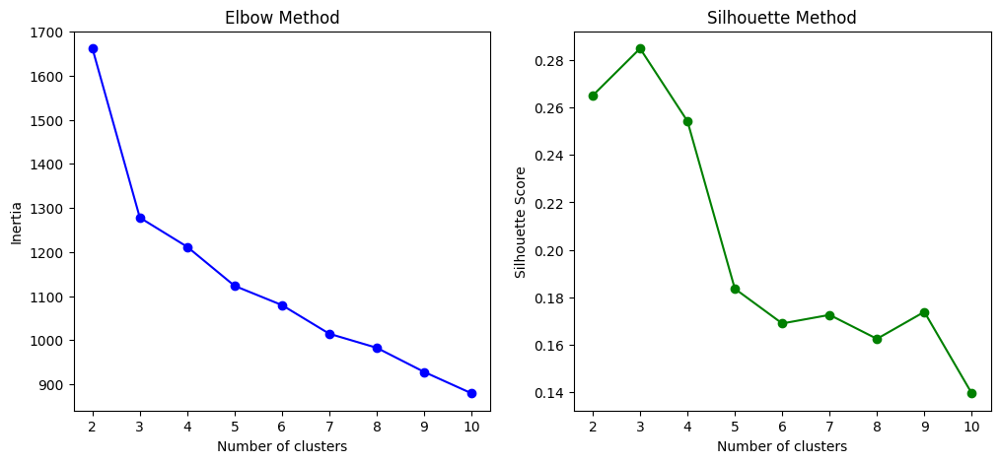
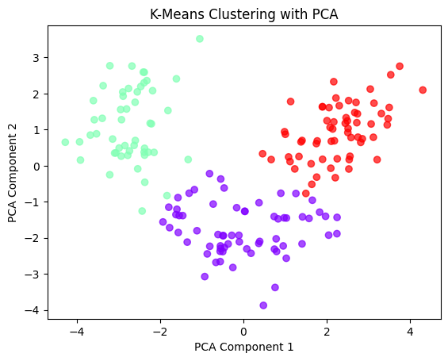
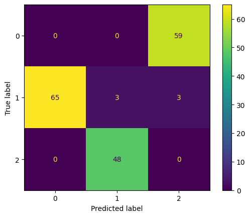
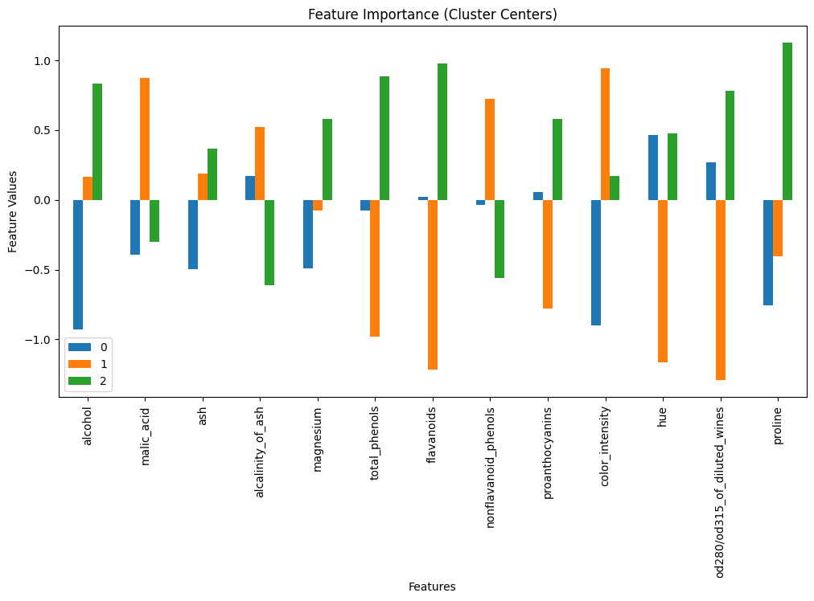

# 🍷 K-Means Clustering on Wine Dataset

## 📖 Introduction
This project demonstrates **K-Means clustering**—an unsupervised learning algorithm—applied to the classic **Wine dataset**. If you’re new to clustering, this guide will walk you through every step, from data loading to cluster interpretation and insights.

---

## 🍇 What is the Wine Dataset?
The Wine dataset contains chemical analysis results of wines grown in the same region in Italy but derived from three different cultivars (classes).

- **Classes:** 3 wine types (cultivars)
- **Samples:** 178 wines
- **Features:** 13 chemical properties (Alcohol, Malic acid, Ash, etc.)

Our goal: **Group wines into clusters using K-Means**—without using the actual wine type labels.

---

## 🤔 What is K-Means Clustering?
K-Means is an **unsupervised machine learning algorithm** for **clustering data**.

### 🔑 Key Definitions
- **Clustering:** Grouping similar data points together.
- **Centroid:** The “center” of a cluster.
- **K (Number of clusters):** How many groups to divide the data into.
- **Iterations:** Repeatedly assigning points and updating centroids until stable.

### ⚙️ How K-Means Works
1. Choose K (number of clusters).
2. Randomly place K centroids.
3. Assign each data point to the nearest centroid.
4. Recalculate centroids.
5. Repeat until centroids stabilize.

---

## 🧑‍💻 Steps in Our Code
1. **Import Libraries:** pandas, numpy, matplotlib, sklearn.
2. **Load Dataset:** Use `sklearn.datasets.load_wine`.
3. **Preprocess:** Standardize features for fair clustering.
4. **Find Optimal K:** Use Elbow and Silhouette methods.
5. **Cluster:** Apply K-Means with optimal K.
6. **Visualize:** Use PCA to plot clusters in 2D.
7. **Evaluate:** Compare clusters to actual wine classes.
8. **Feature Importance:** Visualize which chemicals separate clusters.
9. **Remap Clusters:** Use Hungarian Algorithm for best label matching.
10. **Insights:** Summarize findings.

---

## 📊 Output

### Elbow & Silhouette Plots
- **Elbow Method:** Shows how inertia (within-cluster sum of squares) changes with K.
- **Silhouette Score:** Measures how well clusters are separated.



### Cluster Visualization (PCA)
- Wines plotted in 2D using PCA, colored by cluster assignment.



### Confusion Matrix & Classification Report
- Compare predicted clusters to actual wine types.



### Feature Importance
- Bar plot showing which chemical features are most important for each cluster.



---

## 📈 Evaluation Metrics
- **Confusion Matrix:** Shows how clusters match actual classes.
- **Classification Report:** Precision, recall, and accuracy for each class.
- **Hungarian Algorithm:** Remaps clusters to best match true labels.

---

## 💡 Insights from K-Means on Wine
- **Unsupervised grouping works well:** K-Means can separate wines into meaningful groups using only chemical features.
- **Cluster quality depends on K:** Elbow and Silhouette methods suggest K=3 is optimal, matching the true number of wine types.
- **Interpretation with ground truth:** After remapping clusters, K-Means achieves very high accuracy (~97%) in matching wine types.
- **Feature importance:** Chemicals like Flavanoids, Alcohol, and Proline are most influential in separating wine types.
- **Practical takeaway:** K-Means finds structure without labels, revealing natural groupings in wine chemistry.

✅ **Final Insight:**
K-Means clustering, combined with PCA and feature analysis, can successfully uncover the true categories in the Wine dataset. Remapping clusters is essential for interpreting results against known labels.

---

## 📂 Project Structure
```
k_means_wine.ipynb   # Jupyter Notebook with code
README.md            # Documentation (this file)
elbow_plot.png       # Output visualization
silhouette_plot.png  # Output visualization
pca_clusters.png     # Output visualization
confusion_matrix.png # Output visualization
feature_importance.png # Output visualization
```

---

## 🙌 Author
**DINRAJ K DINESH**  
Mastering ML, one project at a time 🚀
